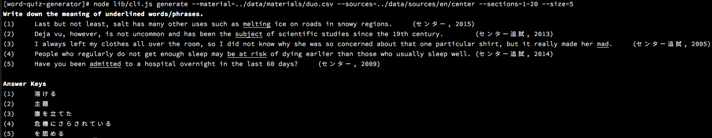

# Word Quiz Generator

[](https://travis-ci.org/nodaguti/word-quiz-generator)
[](https://coveralls.io/github/nodaguti/word-quiz-generator?branch=master)
[](https://david-dm.org/nodaguti/word-quiz-generator)
[](https://david-dm.org/nodaguti/word-quiz-generator#info=devDependencies)
[](https://codeclimate.com/github/nodaguti/word-quiz-generator)



A tool for generating a vocabulary quiz.

Unlike existing generators, Word Quiz Generator produces "Write the definition" questions by extracting a sentence that contains a specific word/phrase from given source texts.

This package only provides a CLI tool and APIs. For the Web Application version of Word Quiz Generator, please see [word-quiz-generator-webapp](https://github.com/nodaguti/word-quiz-generator-webapp).

## Install
If you will use Word Quiz Generator as an CLI tool, install globally:
```
$ npm install -g word-quiz-generator
```

If you will use Word Quiz Generator from your program (i.e. using the APIs), you may want to install without the `-g` flag but with `--save` flag:
```
$ npm install --save word-quiz-generator
```

## CLI
```
$ word-quiz-generator <command> [<args>]
```

You can see details of each commands by executing a command with `--help`, e.g. `word-quiz-generator generate --help`.

### generate
```
word-quiz-generator generate --material=<path> --sources=<paths> --sections --size [--instruction] [--lang] [--sentenceSeparator=<RegExp>] [--clauseRegExp=<RegExp>] [--wordRegExp=<RegExp>] [--wordBoundaryRegExp=<RegExp>] [--abbrRegExp=<RegExp>]
```
`generate` command will generate a quiz and put it to stdout using the given material and sources.

#### Options
- `--material`

  A path string to a material (phrase list) file.
  A material file should be CSV-formatted and has *section*, *phrase* and *answer* columns.
  See [Material](#material) for more details.

- `--sources`

  Comma-separated path strings to text files that will be used as a question sentence.
  A source file should have reference information as the first line and the rest of the file will be the body text.
  See [Source](#source) for more details.

- `--sections`

  A string representing the range of the material to be on the quiz.
  Each numbers represents the start and end section number respectively.

- `--size`

  The number of questions in a quiz.

- `--instruction`

  An instruction message that will be located at the top of the quiz.

The following options determines how to extract a word/phrase or sentence from a text.
For English quiz, these are automatically set and usually don't need to override them.

- `--lang`

  IETF langage tag in which the material are written.
  This determines how to extract a word/phrase or sentence from a text.
  If you need more precise control over the extraction algorithm,
  please use `--sentenceSeparator`, `--clauseRegExp`, `--wordRegExp`,
  `--wordBoundaryRegExp`, and/or `--abbrRegExp` to override.

  Default: `en` (English)

- `--sentenceSeparator`

  Regular expression representing a sentence separator.

- `--clauseRegExp`

  Regular expression representing a clause.

- `--wordRegExp`

  Regular expression representing a word.

- `--wordBoundaryRegExp`

  Regular expression representing a word boundary.

- `--abbrRegExp`

  Regular expression representing an abbreviation mark.

#### Example
```
$ word-quiz-generator generate \
  --material=/path/to/phrase-list.csv \
  --sources=/path/to/source-texts \
  --sections=1-10 \
  --size=10
```

### coverage
```
word-quiz-generator coverage --material=<path> --sources=<paths> [--lang] [--show-uncovered] [--sentenceSeparator=<RegExp>] [--clauseRegExp=<RegExp>] [--wordRegExp=<RegExp>] [--wordBoundaryRegExp=<RegExp>] [--abbrRegExp=<RegExp>]
```
`coverage` command will measure the phrase coverage against the given sources. It's usuful when you want to know whether the amount of sources is sufficient.

#### Options
- `--show-uncovered`

  Showing the uncovered words/phrases.

- Other options are the same as those of `generate` command.

### install
```
word-quiz-generator install <package name> [... <package name>]
```
`install` command will install the dependent binaries under `${package's root}/vendor` that are needed for [preprocessing and lemmatizing](#preprocessing-and-lemmatizing).

#### Available Packages
- `CoreNLP`

  [A suite of core NLP (natural language processing) tools](https://stanfordnlp.github.io/CoreNLP/) by Stanford University.

- `MeCab`

  [Yet Another Part-of-Speech and Morphological Analyzer](https://mecab.googlecode.com/svn/trunk/mecab/doc/index.html) by Kyoto University and NTT.

#### Package to install
The packages you need to install depend on what languages do you want to test in your quizzes.

|Language|Language Tag (`--lang`)|Required Package(s)|
|:---:|:---:|:---:|
|English|en|CoreNLP|
|Old Japanese (古文, _kobun_)|ojp|MeCab|

### make
```
word-quiz-generator make --src=<path> --lang=<lang>
word-quiz-generator make --src=<path> [--preprocessor=<path>] [--lemmatizer=<path>]
```

`make` command will generate [preprocessed and lemmatized texts](#preprocessing-and-lemmatizing) from the given sources.

#### Options
- `--src`

  Comma-separated path strings to be processed.

- `--lang`

  [IETF langage tag](https://en.wikipedia.org/wiki/IETF_language_tag) in which source texts are written.
  This tells the generator which built-in preprocesser and lemmatizer should be used.
  If you want to use your custom ones, please use `--preprocessor` and `--lemmatizer` options.

- `--preprocessor`

  Path to a custom preprocessor.
  A custom preprocessor must export an async function as default which returns the preprocessed text.

- `--lemmatizer`

  Path to a custom lemmatizer.
  A custom lemmatizer must export an async function as default which returns the lemmatized text.

## API
### QuizGenerator(options)
Create a new instance that can generate a quiz.

The available options are `material`, `sources`, `lang`, `sentenceSeparator`, `clauseRegExp`, `wordRegExp`, `wordBoundaryRegExp` and `abbrRegExp`, all of which are same as the corresponding `generate` options.

### .init()
Initialize a instance. The reason why the initialization is not conducted in `constructor()` is in this method we load and parse the files of material and sources, which is an asynchronous process.

You __must__ call this method before doing your jobs.

### quiz(options)
Generate a quiz and return an array of questions.

#### sections
A string representing which sections of the material should be on quiz. For example, `5-7` means the quiz target is Section 5, 6 and 7.

#### size
A number representing the number of questions in the quiz. If you specify the larger number than the number of phrases in the material, the generator creates as many questions as possible (i.e. the number of phrases in the material).

### question(phrase)
Generate a question using the given phrase. If no sentences that contain the given phrase are found, this method returns `null`.

`phrase` should be an object that has the following properties.

- `phrase`

  A phrase to be on quiz.

- `answer`

 An answer (usually the meaning of the phrase).


## Material
__Material__ is a collection of words/phrases.

### Format
CSV with the following columns.
```csv
<section number>,<phrase>,<answer>
```

#### section number
A section number represents which unit does a word belong to in the material.

#### phrase
A phrase represents an expression to be on quiz. There are some special characters:

- `|`

  Indicating these different expressions should be treated as an single item, e.g. `color|colour`.

- `...`

  Indicating some words are to be inserted, e.g. `think ... of`.
  This expression can be changed through the `abbrRegExp` option in `generator`/`coverage` command and `QuizGenerator` class.

Be careful that `phrase` will be searched against [a lemmatized text](#preprocessing-and-lemmatizing).
This means you may have to write a seemingly odd phrase instead of a natural expression if you prepare a lemmatized text.

For example, when you are using the built-in English preprocessor and lemmatizer, you have to write:

- `be go to` instead of `be going to`
  - All words should be the dictionary form.
- `one's pleasure` instead of `My pleasure`
  - All possessive pronoun should be `one's`.
- `by oneself` instead of `by myself`
  - All personal pronouns should be `one` or `oneself`
- `one'be a piece of cake` instead of `It's a piece of cake`

#### answer
An answer represents the meaning of the phrase.

## Source

__Source__ is a text with reference information. Word Quiz Generator will extract a sentence from the body text of a source and create a question.

A source text file should have a _reference_ as the first line of a file and _text_ as the rest part of a file.

e.g.
The content of a source file of *De finibus bonorum et malorum* written by Marcus Tullius Cicero will be

```
De finibus bonorum et malorum, Marcus Tullius Cicero
Sed ut perspiciatis, unde omnis iste natus error sit voluptatem accusantium doloremque laudantium, totam rem aperiam eaque ipsa, quae ab illo inventore veritatis et quasi architecto beatae vitae dicta sunt, explicabo.
Nemo enim ipsam voluptatem, quia voluptas sit, aspernatur aut odit aut fugit, sed quia consequuntur magni dolores eos,
...
```

## Preprocessing and Lemmatizing

Word Quiz Generator even works against plain text files, but preprocessing and lemmatizing an original text improve the quality of a generated quiz.

The generator treats a file whose name ends `.preprocessed` at the same directory as the preprocessed version text, and whose name ends `.lemmatized` as the lemmatized version text.

```
~/sources/foo-bar.txt               # original
~/sources/foo-bar.txt.preprocessed  # preprocessed
~/sources/foo-bar.txt.lemmatized    # lemmatized
```

If preprocessed or lemmatized text is not found, then the generator uses the original text as an input.

### Preprocessing
Preprocessed texts will be used in lemmatization and displaying a question. Preprocessing can enhance the accuracy on lemmatization and/or the readability of a question sentence.
As for the built-in English preprocessor, for example, it includes removing unnecessary line breaks and soft hyphens.

### Lemmatizing/Lemmatization
Lemmatized texts will be used in searching sentences.
Lemmatization can improve the precision and recall of searching a sentence with a specific word/phrase.

For instance, imagine the generator is creating a question using 'go through'. If no processes are applied to the original text, sentences like

> Comets may **go through** a transition phase as they come close to extinction.

(from Wikipedia, "[Extinct comet](https://en.wikipedia.org/wiki/Extinct_comet)")

can be picked up by the generator, while

> If another sailor **went through** the bag, the odds were high the thief would tie the bag back

(from Wikipedia, "[Thief knot](https://en.wikipedia.org/wiki/Thief_knot)")

will not.

To make such sentences recognizable to the generator, the [lemmatisation](https://en.wikipedia.org/wiki/Lemmatisation) process is needed. It will replace each words with its lemma. Therefore the above sentence becomes

> if another sailor **go** through the bag, the **odd** **be** high the thief **will** tie the bag back

and the generator is now able to know the sentence contains the phrase "go through".

### CLI
In word-quiz-generator, you can preprocess and lemmatize your text from CLI.

1. Install binary dependencies, which parse a text and convert each words into their lemma. 👉 See [install](#install).

  ```
  word-quiz-generator install [package name]
  ```

2. Run `make` command. 👉 See [make](#make).

  ```
  word-quiz-generator make --src=<path to sources> --lang=<language tag>
  ```

## Tests
```
npm test
```

## Contributing

1. Fork it!
2. Create your feature branch: `git checkout -b my-new-feature`
3. Commit your changes: `git commit -am 'Add some feature'`
4. Push to the branch: `git push origin my-new-feature`
5. Submit a pull request :D

## License

MIT License (http://nodaguti.mit-license.org/)

## Acknowledgment

- [Stanford CoreNLP](https://stanfordnlp.github.io/CoreNLP/).
  - Used for preprocessor and lemmatizer of English.
- [GNU Collaborative International Dictionary of English](http://gcide.gnu.org.ua/), GNU Dico, GNU General Public License.
  - Used for the test data (materials) of English.
- [Wikipedia](https://www.wikipedia.org/),  Creative Commons Attribution-ShareAlike 3.0 Unported License.
  - Used for the test data (sources) of English.
- [UniDic for Early Middle Japanese (中古和文UniDic)](http://www2.ninjal.ac.jp/lrc/index.php?UniDic%2F%C3%E6%B8%C5%CF%C2%CA%B8UniDic), Toshinobu Ogiso, [UniDic License](http://www2.ninjal.ac.jp/lrc/index.php?UniDic%2F%C3%E6%B8%C5%CF%C2%CA%B8UniDic#u7300511).
  - Used for the preprocessor and lemmatizer of Old Japanese (ojp).
- [Izayoi Nikki (十六夜日記)](http://www2s.biglobe.ne.jp/~Taiju/isayoi.htm), degitized by Taiju, retrieved from [日本古典文学テキスト](http://www2s.biglobe.ne.jp/~Taiju/classic.htm), Public Domain.
  - Used for the test data (sources) of Old Japanese.
- [Wikisource (Japanese)](https://ja.wikisource.org/), Creative Commons Attribution-ShareAlike 3.0 Unported License.
  - Used for the test data (sources) of Old Japanese.
